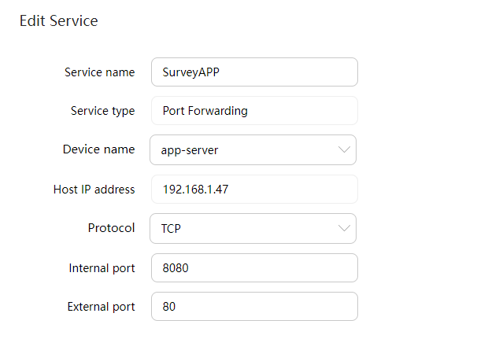
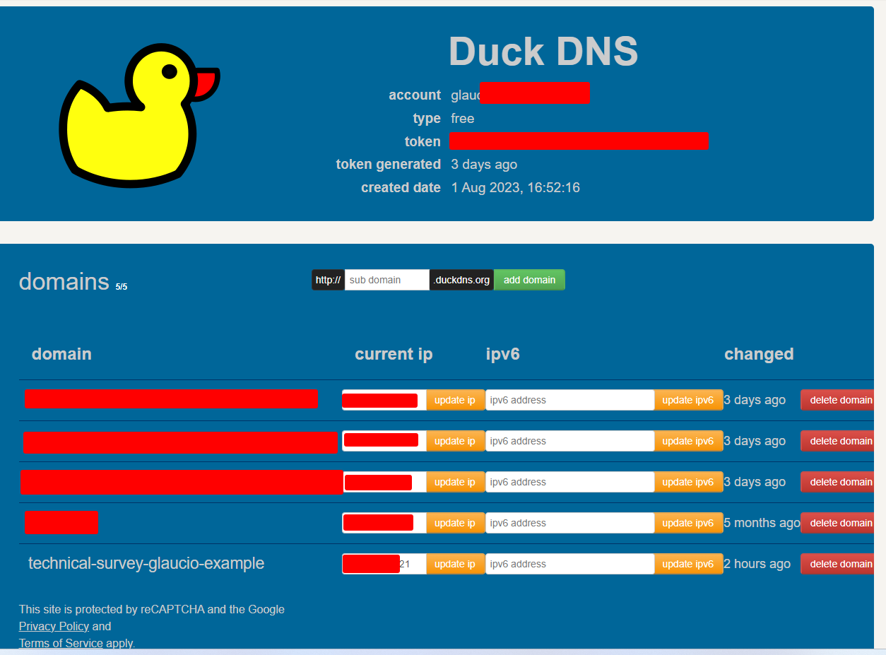

### Technical Exercise

Today we have two linux machines one with docker installed and another with database and a domain record A pointed public IP, and the main problem is that the frontend VM is out of resources to complete the surveys, interrupting the requests made.

**Diagram**


So we are going to do a lift shift to Oracle Cloud provider.

First I simulated the on-premisses scenario using Virtualbox and nextcloud app:

Installed Ubuntu Linux on 2 VMS:

On **db-server**:

- Updated Ubuntu Linux
```bash
sudo apt update && apt upgrade -y
```

- **Installed PostgreSQL**

```bash
sudo su
apt install postgresql postgresql-contrib
```

- **Created user_db and database**
```bash
$ su postgres
$ psql

CREATE USER db_user WITH ENCRYPTED PASSWORD '<password>';
CREATE DATABASE technical_exercise WITH OWNER db_user;
```

- **Added the ip address of app VM pg_hba.conf file to allow remote connections**

```bash
# /etc/postgresql/14/main/pg_hba.conf
local   all             postgres                                peer
host    technical_exercise         db_user          <app-vm-ip>/32        scram-sha-256
```

- Uncommented a line on file postgresql.conf to listen IP from NIC

```bash
# /etc/postgresql/14/main/postgresql.conf

listen_addresses = '<vm-db-ip>'
```

- restarted postgresql

```bash
systemctl restart postgresql
```
---

On **app-server**:

- Updated Ubuntu Linux
```bash
sudo apt update && apt upgrade -y
```

- Installed docker engine:

```bash
# Add Docker's official GPG key:
sudo apt-get update
sudo apt-get install ca-certificates curl gnupg
sudo install -m 0755 -d /etc/apt/keyrings
curl -fsSL https://download.docker.com/linux/ubuntu/gpg | sudo gpg --dearmor -o /etc/apt/keyrings/docker.gpg
sudo chmod a+r /etc/apt/keyrings/docker.gpg

# Add the repository to Apt sources:
echo \
  "deb [arch=$(dpkg --print-architecture) signed-by=/etc/apt/keyrings/docker.gpg] https://download.docker.com/linux/ubuntu \
  $(. /etc/os-release && echo "$VERSION_CODENAME") stable" | \
  sudo tee /etc/apt/sources.list.d/docker.list > /dev/null
sudo apt-get update
```

```bash
sudo apt-get install docker-ce docker-ce-cli containerd.io docker-buildx-plugin docker-compose-plugin
```

- As a regular user, added to docker group and created a directory called "app":

```bash
  sudo groupadd docker
  sudo usermod -aG docker $USER
  mkdir -p app
  cd app
  exit
```
**Started another shell session to apply the docker group config**


- Created the Docker compose file on app folder:

```yaml
version: '2'

volumes:
  nextcloud:

services:

  redis:
    container_name: nextcloud-redis
    image: redis:alpine
    restart: always
    volumes:
      - rediscache:/data

  app:
    image: nextcloud:fpm
    restart: always
    depends_on:
      - db
      - redis
    volumes:
      - nextcloud:/var/www/html
    env_file:
      - ./.env

  web:
    image: nginx
    restart: always
    ports:
      - 8080:80
      - 8443:443
    links:
      - app
    volumes:
      - ./nginx.conf:/etc/nginx/nginx.conf:ro
    volumes_from:
      - app
```


- Created a .env file to set environment variables

```
POSTGRES_DB=<db>
POSTGRES_USER=<db_user>
POSTGRES_PASSWORD=<password>
POSTGRES_HOST=<db-host>:5432
NEXTCLOUD_ADMIN_PASSWORD=<password>
NEXTCLOUD_ADMIN_USER=<user>
NEXTCLOUD_TRUSTED_DOMAINS=127.0.0.1 localhost <ipaddr> <url>
REDIS_HOST=redis
```

- Created nginx.conf
```bash
worker_processes auto;

error_log  /var/log/nginx/error.log warn;
pid        /var/run/nginx.pid;


events {
    worker_connections  1024;
}


http {
    include       /etc/nginx/mime.types;
    default_type  application/octet-stream;

    log_format  main  '$remote_addr - $remote_user [$time_local] "$request" '
                      '$status $body_bytes_sent "$http_referer" '
                      '"$http_user_agent" "$http_x_forwarded_for"';

    access_log  /var/log/nginx/access.log  main;

    sendfile        on;
    #tcp_nopush     on;

    keepalive_timeout  65;

    set_real_ip_from  10.0.0.0/8;
    set_real_ip_from  172.16.0.0/12;
    set_real_ip_from  192.168.0.0/16;
    real_ip_header    X-Real-IP;

    #gzip  on;

    upstream php-handler {
        server app:9000;
    }

    server {
        listen 80;

        # Add headers to serve security related headers
        # Before enabling Strict-Transport-Security headers please read into this
        # topic first.
        #add_header Strict-Transport-Security "max-age=15768000; includeSubDomains; preload;" always;
        #
        # WARNING: Only add the preload option once you read about
        # the consequences in https://hstspreload.org/. This option
        # will add the domain to a hardcoded list that is shipped
        # in all major browsers and getting removed from this list
        # could take several months.
        add_header Referrer-Policy "no-referrer" always;
        add_header X-Content-Type-Options "nosniff" always;
        add_header X-Download-Options "noopen" always;
        add_header X-Frame-Options "SAMEORIGIN" always;
        add_header X-Permitted-Cross-Domain-Policies "none" always;
        add_header X-Robots-Tag "none" always;
        add_header X-XSS-Protection "1; mode=block" always;

        # Remove X-Powered-By, which is an information leak
        fastcgi_hide_header X-Powered-By;

        # Path to the root of your installation
        root /var/www/html;

        location = /robots.txt {
            allow all;
            log_not_found off;
            access_log off;
        }

        # The following 2 rules are only needed for the user_webfinger app.
        # Uncomment it if you're planning to use this app.
        #rewrite ^/.well-known/host-meta /public.php?service=host-meta last;
        #rewrite ^/.well-known/host-meta.json /public.php?service=host-meta-json last;

        # The following rule is only needed for the Social app.
        # Uncomment it if you're planning to use this app.
        #rewrite ^/.well-known/webfinger /public.php?service=webfinger last;

        location = /.well-known/carddav {
            return 301 $scheme://$host:$server_port/remote.php/dav;
        }

        location = /.well-known/caldav {
            return 301 $scheme://$host:$server_port/remote.php/dav;
        }

        # set max upload size
        client_max_body_size 25G;
        fastcgi_buffers 64 4K;

        # Enable gzip but do not remove ETag headers
        gzip on;
        gzip_vary on;
        gzip_comp_level 4;
        gzip_min_length 256;
        gzip_proxied expired no-cache no-store private no_last_modified no_etag auth;
        gzip_types application/atom+xml application/javascript application/json application/ld+json application/manifest+json application/rss+xml application/vnd.geo+json application/vnd.ms-fontobject application/x-font-ttf application/x-web-app-manifest+json application/xhtml+xml application/xml font/opentype image/bmp image/svg+xml image/x-icon text/cache-manifest text/css text/plain text/vcard text/vnd.rim.location.xloc text/vtt text/x-component text/x-cross-domain-policy;

        # Uncomment if your server is build with the ngx_pagespeed module
        # This module is currently not supported.
        #pagespeed off;

        location / {
            rewrite ^ /index.php;
        }

        location ~ ^\/(?:build|tests|config|lib|3rdparty|templates|data)\/ {
            deny all;
        }
        location ~ ^\/(?:\.|autotest|occ|issue|indie|db_|console) {
            deny all;
        }

        location ~ ^\/(?:index|remote|public|cron|core\/ajax\/update|status|ocs\/v[12]|updater\/.+|oc[ms]-provider\/.+)\.php(?:$|\/) {
            fastcgi_split_path_info ^(.+?\.php)(\/.*|)$;
            set $path_info $fastcgi_path_info;
            try_files $fastcgi_script_name =404;
            include fastcgi_params;
            fastcgi_param SCRIPT_FILENAME $document_root$fastcgi_script_name;
            fastcgi_param PATH_INFO $path_info;
            # fastcgi_param HTTPS on;

            # Avoid sending the security headers twice
            fastcgi_param modHeadersAvailable true;

            # Enable pretty urls
            fastcgi_param front_controller_active true;
            fastcgi_pass php-handler;
            fastcgi_intercept_errors on;
            fastcgi_request_buffering off;
        }

        location ~ ^\/(?:updater|oc[ms]-provider)(?:$|\/) {
            try_files $uri/ =404;
            index index.php;
        }

        # Adding the cache control header for js, css and map files
        # Make sure it is BELOW the PHP block
        location ~ \.(?:css|js|woff2?|svg|gif|map)$ {
            try_files $uri /index.php$request_uri;
            add_header Cache-Control "public, max-age=15778463";
            # Add headers to serve security related headers (It is intended to
            # have those duplicated to the ones above)
            # Before enabling Strict-Transport-Security headers please read into
            # this topic first.
            #add_header Strict-Transport-Security "max-age=15768000; includeSubDomains; preload;" always;
            #
            # WARNING: Only add the preload option once you read about
            # the consequences in https://hstspreload.org/. This option
            # will add the domain to a hardcoded list that is shipped
            # in all major browsers and getting removed from this list
            # could take several months.
            add_header Referrer-Policy "no-referrer" always;
            add_header X-Content-Type-Options "nosniff" always;
            add_header X-Download-Options "noopen" always;
            add_header X-Frame-Options "SAMEORIGIN" always;
            add_header X-Permitted-Cross-Domain-Policies "none" always;
            add_header X-Robots-Tag "none" always;
            add_header X-XSS-Protection "1; mode=block" always;

            # Optional: Don't log access to assets
            access_log off;
        }

        location ~ \.(?:png|html|ttf|ico|jpg|jpeg|bcmap)$ {
            try_files $uri /index.php$request_uri;
            # Optional: Don't log access to other assets
            access_log off;
        }
    }

}
```

- Forwarded external port HTTP to internal 8080 of my container running on a VM.



- Created a domain name on duckdns pointing to my IP address

- App frontend


- Added a app survey with forms



---
